# Trust Registry Ecosystem Diagrams

## 1. Global Trust Registry Interoperability

```mermaid
graph TB
    subgraph "🌍 Global Layer"
        GLOBAL[🌐 Global Trust Framework<br/>International Standards Body]
    end

    subgraph "🗺️ Continental Layer"
        subgraph "Asia Pacific"
            APAC[🏛️ APAC Trust Framework<br/>did:web:trust.apac.org]
        end
        subgraph "Europe"
            EU[🏛️ EU Trust Framework<br/>did:web:trust.europa.eu]
        end
        subgraph "Americas"
            AMER[🏛️ Americas Trust Framework<br/>did:web:trust.americas.org]
        end
    end

    subgraph "🏳️ National Layer - Asia Pacific"
        ID[🇮🇩 Indonesia Registry<br/>did:web:trust.go.id]
        SG[🇸🇬 Singapore Registry<br/>did:web:trust.gov.sg]
        MY[🇲🇾 Malaysia Registry<br/>did:web:trust.gov.my]
        AU[🇦🇺 Australia Registry<br/>did:web:trust.gov.au]
        JP[🇯🇵 Japan Registry<br/>did:web:trust.go.jp]
    end

    subgraph "🏳️ National Layer - Europe"
        DE[🇩🇪 Germany Registry<br/>did:web:trust.bund.de]
        FR[🇫🇷 France Registry<br/>did:web:trust.gouv.fr]
        NL[🇳🇱 Netherlands Registry<br/>did:web:trust.overheid.nl]
    end

    subgraph "🏳️ National Layer - Americas"
        US[🇺🇸 USA Registry<br/>did:web:trust.gov]
        CA[🇨🇦 Canada Registry<br/>did:web:trust.gc.ca]
        BR[🇧🇷 Brazil Registry<br/>did:web:trust.gov.br]
    end

    %% Global to Continental
    GLOBAL -.->|"governs"| APAC
    GLOBAL -.->|"governs"| EU
    GLOBAL -.->|"governs"| AMER

    %% Continental to National
    APAC --> ID
    APAC --> SG
    APAC --> MY
    APAC --> AU
    APAC --> JP

    EU --> DE
    EU --> FR
    EU --> NL

    AMER --> US
    AMER --> CA
    AMER --> BR

    %% Cross-Continental Recognition
    APAC <-.->|"🤝 Mutual Recognition"| EU
    EU <-.->|"🤝 Mutual Recognition"| AMER
    APAC <-.->|"🤝 Mutual Recognition"| AMER

    style GLOBAL fill:#6366f1,color:#fff
    style APAC fill:#8b5cf6,color:#fff
    style EU fill:#8b5cf6,color:#fff
    style AMER fill:#8b5cf6,color:#fff
    style ID fill:#ef4444,color:#fff
    style SG fill:#ef4444,color:#fff
    style MY fill:#ef4444,color:#fff
    style AU fill:#ef4444,color:#fff
    style JP fill:#ef4444,color:#fff
    style DE fill:#3b82f6,color:#fff
    style FR fill:#3b82f6,color:#fff
    style NL fill:#3b82f6,color:#fff
    style US fill:#10b981,color:#fff
    style CA fill:#10b981,color:#fff
    style BR fill:#10b981,color:#fff
```

---

## 2. ASEAN Cross-Border Trust Network

---

## 3. National to Local Hierarchy (Indonesia Example)

```mermaid
graph TB
    subgraph "🇮🇩 National Level"
        NAT[🏛️ National Trust Framework<br/>Kominfo / BSSN]
        NAT_REG[🗄️ National Registry<br/>did:web:trust.go.id]
    end

    subgraph "🏢 Sectoral Level"
        EDU_REG[🗄️ Education Registry<br/>did:web:dikti.kemdikbud.go.id]
        FIN_REG[🗄️ Financial Registry<br/>did:web:ojk.go.id]
        HEALTH_REG[🗄️ Healthcare Registry<br/>did:web:kemkes.go.id]
        GOV_REG[🗄️ Government Registry<br/>did:web:dukcapil.kemendagri.go.id]
    end

    subgraph "🏫 Education Issuers"
        UI[✅ Universitas Indonesia]
        ITB[✅ Institut Teknologi Bandung]
        UGM[✅ Universitas Gadjah Mada]
        UNAIR[✅ Universitas Airlangga]
    end

    subgraph "🏦 Financial Issuers"
        BI[✅ Bank Indonesia]
        BCA[✅ Bank BCA]
        MANDIRI[✅ Bank Mandiri]
    end

    subgraph "🏥 Healthcare Issuers"
        KEMENKES[✅ Kementerian Kesehatan]
        RSUP[✅ RSUP Cipto]
        BPJS[✅ BPJS Kesehatan]
    end

    subgraph "🏛️ Government Issuers"
        DUKCAPIL[✅ Dukcapil]
        IMIGRASI[✅ Imigrasi]
        POLRI[✅ Polri]
    end

    subgraph "👤 Verifiers"
        V_BANK[👤 Banks]
        V_TELCO[👤 Telcos]
        V_ECOM[👤 E-Commerce]
        V_GOV[👤 Gov Services]
    end

    NAT --> NAT_REG
    NAT_REG --> EDU_REG
    NAT_REG --> FIN_REG
    NAT_REG --> HEALTH_REG
    NAT_REG --> GOV_REG

    EDU_REG --> UI
    EDU_REG --> ITB
    EDU_REG --> UGM
    EDU_REG --> UNAIR

    FIN_REG --> BI
    FIN_REG --> BCA
    FIN_REG --> MANDIRI

    HEALTH_REG --> KEMENKES
    HEALTH_REG --> RSUP
    HEALTH_REG --> BPJS

    GOV_REG --> DUKCAPIL
    GOV_REG --> IMIGRASI
    GOV_REG --> POLRI

    NAT_REG --> V_BANK
    NAT_REG --> V_TELCO
    NAT_REG --> V_ECOM
    NAT_REG --> V_GOV

    style NAT fill:#6366f1,color:#fff
    style NAT_REG fill:#8b5cf6,color:#fff
    style EDU_REG fill:#3b82f6,color:#fff
    style FIN_REG fill:#10b981,color:#fff
    style HEALTH_REG fill:#ef4444,color:#fff
    style GOV_REG fill:#f59e0b,color:#fff
```

---

## 4. Credential Issuance Flow

---

## 5. Complete Trust Triangle

```mermaid
graph TB
    subgraph "Trust Registry"
        TR[🗄️ Trust Registry<br/>did:web:registry.example.com]
        TF[🛡️ Trust Framework]
        Schema[📄 Credential Schema]
    end

    subgraph "Issuer"
        I[✅ Issuer<br/>did:web:issuer.example.com]
        VC[📜 Verifiable Credential]
    end

    subgraph "Holder"
        H[👤 Holder]
        W[💼 Wallet]
    end

    subgraph "Verifier"
        V[👤 Verifier<br/>did:web:verifier.example.com]
        VP[📋 Verification Policy]
    end

    TF --> TR
    Schema --> TR
    
    TR -->|"registers"| I
    TR -->|"registers"| V
    
    I -->|"issues"| VC
    VC -->|"stored in"| W
    W -->|"owned by"| H
    
    H -->|"presents"| V
    V -->|"queries"| TR
    
    TR -->|"confirms issuer"| V
    TR -->|"confirms verifier"| V

    style TR fill:#3b82f6,color:#fff
    style TF fill:#8b5cf6,color:#fff
    style Schema fill:#06b6d4,color:#fff
    style I fill:#10b981,color:#fff
    style V fill:#f59e0b,color:#fff
    style H fill:#ec4899,color:#fff
    style VC fill:#10b981,color:#fff
    style W fill:#ec4899,color:#fff
```

---

## 6. Issuer Delegation Chain

```mermaid
graph TB
    subgraph "Root Authority"
        ROOT[✅ Ministry of Education<br/>did:web:moe.gov.id<br/>🔑 Root Issuer]
    end

    subgraph "Level 1 Delegates"
        D1[✅ State University<br/>did:web:state-uni.edu<br/>📋 Delegated]
        D2[✅ Private University<br/>did:web:private-uni.edu<br/>📋 Delegated]
    end

    subgraph "Level 2 Delegates"
        D1A[✅ Faculty of Engineering<br/>did:web:eng.state-uni.edu<br/>📋 Sub-delegated]
        D1B[✅ Faculty of Medicine<br/>did:web:med.state-uni.edu<br/>📋 Sub-delegated]
    end

    ROOT -->|"delegates"| D1
    ROOT -->|"delegates"| D2
    D1 -->|"sub-delegates"| D1A
    D1 -->|"sub-delegates"| D1B

    subgraph "Credential Types"
        CT1[📄 UniversityDegree]
        CT2[📄 AcademicTranscript]
        CT3[📄 EngineeringCertificate]
        CT4[📄 MedicalDegree]
    end

    ROOT -.->|"can issue"| CT1
    ROOT -.->|"can issue"| CT2
    D1 -.->|"can issue"| CT1
    D1 -.->|"can issue"| CT2
    D1A -.->|"can issue"| CT3
    D1B -.->|"can issue"| CT4

    style ROOT fill:#ef4444,color:#fff
    style D1 fill:#f59e0b,color:#fff
    style D2 fill:#f59e0b,color:#fff
    style D1A fill:#10b981,color:#fff
    style D1B fill:#10b981,color:#fff
```

---

## 7. TRQP Query Flow

```mermaid
flowchart TB
    subgraph "Client Application"
        APP[🖥️ Application]
    end

    subgraph "Trust Registry API"
        AUTH["/v2/authorization"]
        RECOG["/v2/recognition"]
        META["/v2/metadata"]
    end

    subgraph "Database"
        DB[(🗃️ PostgreSQL)]
    end

    subgraph "Query Types"
        Q1["Authorization Query<br/>Is entity X authorized to<br/>perform action Y on resource Z?"]
        Q2["Recognition Query<br/>Does authority A recognize<br/>authority B for scope S?"]
    end

    APP -->|"POST"| AUTH
    APP -->|"POST"| RECOG
    APP -->|"GET"| META

    AUTH --> DB
    RECOG --> DB
    META --> DB

    AUTH -->|"Response"| Q1
    RECOG -->|"Response"| Q2

    subgraph "Authorization Response"
        AR["✅ authorized: true/false<br/>📋 entity_id<br/>🏛️ authority_id<br/>⚡ action<br/>📦 resource<br/>🕐 time_evaluated"]
    end

    subgraph "Recognition Response"
        RR["✅ recognized: true/false<br/>📋 entity_id<br/>🏛️ authority_id<br/>⚡ action<br/>📦 resource<br/>🕐 time_evaluated"]
    end

    Q1 --> AR
    Q2 --> RR

    style AUTH fill:#10b981,color:#fff
    style RECOG fill:#3b82f6,color:#fff
    style META fill:#8b5cf6,color:#fff
```

---

## 8. Data Flow Architecture

```mermaid
flowchart LR
    subgraph "Frontend (SvelteKit)"
        UI[🖥️ Admin UI]
        API_CLIENT[📡 API Client]
    end

    subgraph "Backend (Express)"
        ROUTES[🛣️ Routes]
        CTRL[🎮 Controllers]
        SVC[⚙️ Services]
        MW[🔒 Middleware]
    end

    subgraph "Database"
        PRISMA[📊 Prisma ORM]
        PG[(🐘 PostgreSQL)]
    end

    subgraph "External"
        EXT[🌐 External Systems]
    end

    UI --> API_CLIENT
    API_CLIENT -->|"HTTP/REST"| ROUTES
    ROUTES --> MW
    MW --> CTRL
    CTRL --> SVC
    SVC --> PRISMA
    PRISMA --> PG

    EXT -->|"TRQP Queries"| ROUTES

    style UI fill:#f97316,color:#fff
    style ROUTES fill:#3b82f6,color:#fff
    style CTRL fill:#10b981,color:#fff
    style SVC fill:#8b5cf6,color:#fff
    style PG fill:#06b6d4,color:#fff
```

---

## 9. Entity Lifecycle

---

## 10. Complete Ecosystem Example

```mermaid
graph TB
    subgraph "Governance Layer"
        GOV[🏛️ Governance Authority<br/>Sets policies and standards]
    end

    subgraph "Trust Framework"
        TF[🛡️ National Digital Identity Framework<br/>Version 2.0]
    end

    subgraph "Trust Registry"
        TR[🗄️ National Trust Registry<br/>did:web:trust.gov.id]
    end

    subgraph "Credential Schemas"
        S1[📄 NationalID v1.0]
        S2[📄 DriverLicense v1.0]
        S3[📄 EducationCredential v1.0]
    end

    subgraph "Issuers"
        I1[✅ Civil Registry Office<br/>did:web:dukcapil.gov.id]
        I2[✅ Police Department<br/>did:web:polri.gov.id]
        I3[✅ Ministry of Education<br/>did:web:kemdikbud.gov.id]
    end

    subgraph "Verifiers"
        V1[👤 Bank ABC<br/>did:web:bank-abc.id]
        V2[👤 Telco XYZ<br/>did:web:telco-xyz.id]
        V3[👤 E-Commerce Platform<br/>did:web:ecommerce.id]
    end

    subgraph "Holders"
        H1[👤 Citizen A]
        H2[👤 Citizen B]
        H3[👤 Citizen C]
    end

    GOV --> TF
    TF --> TR
    TR --> S1
    TR --> S2
    TR --> S3

    TR -->|"authorizes"| I1
    TR -->|"authorizes"| I2
    TR -->|"authorizes"| I3

    TR -->|"authorizes"| V1
    TR -->|"authorizes"| V2
    TR -->|"authorizes"| V3

    I1 -->|"issues NationalID"| H1
    I1 -->|"issues NationalID"| H2
    I2 -->|"issues DriverLicense"| H1
    I3 -->|"issues EducationCredential"| H3

    H1 -->|"presents"| V1
    H2 -->|"presents"| V2
    H3 -->|"presents"| V3

    V1 -->|"queries"| TR
    V2 -->|"queries"| TR
    V3 -->|"queries"| TR

    style GOV fill:#6366f1,color:#fff
    style TF fill:#8b5cf6,color:#fff
    style TR fill:#3b82f6,color:#fff
    style S1 fill:#06b6d4,color:#fff
    style S2 fill:#06b6d4,color:#fff
    style S3 fill:#06b6d4,color:#fff
    style I1 fill:#10b981,color:#fff
    style I2 fill:#10b981,color:#fff
    style I3 fill:#10b981,color:#fff
    style V1 fill:#f59e0b,color:#fff
    style V2 fill:#f59e0b,color:#fff
    style V3 fill:#f59e0b,color:#fff
    style H1 fill:#ec4899,color:#fff
    style H2 fill:#ec4899,color:#fff
    style H3 fill:#ec4899,color:#fff
```

---

## Legend

| Symbol | Meaning |
|--------|---------|
| 🛡️ | Trust Framework |
| 🗄️ | Registry |
| ✅ | Issuer |
| 👤 | Verifier / Holder |
| 📄 | Credential Schema |
| 📜 | Verifiable Credential |
| 💼 | Wallet |
| 🤝 | Recognition (Inter-registry trust) |
| 🔑 | Root Authority |
| 📋 | Delegated Authority |

---

## Cara Melihat Diagram

Diagram ini menggunakan format **Mermaid**. Untuk melihat:

1. **VS Code**: Install extension "Markdown Preview Mermaid Support"
2. **GitHub**: Otomatis render saat view file
3. **Online**: Copy ke [Mermaid Live Editor](https://mermaid.live/)
4. **Obsidian**: Native support
