# Credential Issuance & Verification Flow

## 1. Complete Credential Lifecycle

```mermaid
sequenceDiagram
    autonumber
    
    participant H as 👤 Holder<br/>(Citizen)
    participant W as 💼 Wallet<br/>(Mobile App)
    participant I as ✅ Issuer<br/>(University)
    participant TR as 🗄️ Trust Registry
    participant V as 👤 Verifier<br/>(Employer)

    rect rgb(230, 245, 255)
        Note over H,TR: Phase 1: Credential Request & Issuance
        
        H->>W: Open wallet app
        W->>I: Request credential<br/>(with identity proof)
        
        I->>TR: Query: Can I issue this credential?
        Note right of TR: POST /v2/authorization<br/>{<br/>  entity_id: "did:web:university.edu",<br/>  authority_id: "did:web:edu-registry.id",<br/>  action: "issue",<br/>  resource: "UniversityDegree"<br/>}
        
        TR-->>I: ✅ { authorized: true }
        
        I->>I: Create & Sign Credential
        I-->>W: Issue Verifiable Credential
        W->>W: Store credential
        W-->>H: ✅ Credential received!
    end

    rect rgb(255, 245, 230)
        Note over H,V: Phase 2: Credential Presentation & Verification
        
        H->>W: Select credential to share
        W->>V: Present Verifiable Credential
        
        V->>V: Verify signature
        
        V->>TR: Query: Is issuer authorized?
        Note right of TR: POST /v2/authorization<br/>{<br/>  entity_id: "did:web:university.edu",<br/>  authority_id: "did:web:edu-registry.id",<br/>  action: "issue",<br/>  resource: "UniversityDegree"<br/>}
        
        TR-->>V: ✅ { authorized: true }
        
        V->>TR: Query: Can I verify this?
        Note right of TR: POST /v2/authorization<br/>{<br/>  entity_id: "did:web:employer.com",<br/>  authority_id: "did:web:edu-registry.id",<br/>  action: "verify",<br/>  resource: "UniversityDegree"<br/>}
        
        TR-->>V: ✅ { authorized: true }
        
        V-->>H: ✅ Credential Accepted!
    end
```

---

## 2. Trust Registry Query Decision Tree

---

## 3. Cross-Border Credential Verification

```mermaid
sequenceDiagram
    participant H as 👤 Indonesian Citizen
    participant V_SG as 👤 Singapore Employer
    participant TR_SG as 🗄️ Singapore Registry
    participant TR_ID as 🗄️ Indonesia Registry
    participant I_ID as ✅ Indonesian University

    Note over H,I_ID: Scenario: Indonesian graduate applying for job in Singapore

    H->>V_SG: Present Indonesian degree credential
    
    V_SG->>TR_SG: Is Indonesian issuer recognized?
    Note right of TR_SG: POST /v2/recognition<br/>{<br/>  entity_id: "did:web:registry.id",<br/>  authority_id: "did:web:registry.sg",<br/>  action: "recognize",<br/>  resource: "academic-credentials"<br/>}
    
    TR_SG-->>V_SG: ✅ { recognized: true }
    
    V_SG->>TR_ID: Is issuer authorized in Indonesia?
    Note right of TR_ID: POST /v2/authorization<br/>{<br/>  entity_id: "did:web:university.id",<br/>  authority_id: "did:web:registry.id",<br/>  action: "issue",<br/>  resource: "UniversityDegree"<br/>}
    
    TR_ID-->>V_SG: ✅ { authorized: true }
    
    V_SG->>V_SG: Verify credential signature
    V_SG-->>H: ✅ Credential Accepted!
    
    Note over H,I_ID: Cross-border trust established through<br/>inter-registry recognition
```

---

## 4. Delegation Verification Flow

```mermaid
sequenceDiagram
    participant V as 👤 Verifier
    participant TR as 🗄️ Trust Registry
    participant DB as 🗃️ Database

    V->>TR: Check authorization for<br/>did:web:branch-campus.edu

    TR->>DB: Find issuer by DID
    DB-->>TR: Not found as direct issuer

    TR->>DB: Check delegation chain
    DB-->>TR: Found delegation:<br/>Root: did:web:main-university.edu<br/>Delegate: did:web:branch-campus.edu

    TR->>DB: Verify root issuer status
    DB-->>TR: Root issuer: ACTIVE

    TR->>DB: Verify delegation status
    DB-->>TR: Delegation: ACTIVE<br/>Valid until: 2025-12-31

    TR->>DB: Check root issuer has schema
    DB-->>TR: Schema: UniversityDegree ✅

    TR-->>V: ✅ { authorized: true }<br/>via delegation chain

    Note over V,DB: Delegate inherits authorization<br/>from root issuer through delegation
```

---

## 5. Real-World Example: Job Application

```mermaid
graph TB
    subgraph "Step 1: Education"
        UNI[🏫 University ABC]
        STUDENT[👤 Student]
        DEGREE[📜 Degree Credential]
        
        UNI -->|"graduates"| STUDENT
        UNI -->|"issues"| DEGREE
        DEGREE -->|"stored in"| WALLET[💼 Wallet]
    end

    subgraph "Step 2: Job Application"
        WALLET -->|"presents"| EMPLOYER[🏢 Employer XYZ]
    end

    subgraph "Step 3: Verification"
        EMPLOYER -->|"1. Verify signature"| CHECK1{Valid?}
        CHECK1 -->|Yes| QUERY1[Query Trust Registry]
        
        QUERY1 -->|"2. Is issuer authorized?"| TR[🗄️ Trust Registry]
        TR -->|"✅ Yes"| QUERY2[Continue]
        
        QUERY2 -->|"3. Am I authorized to verify?"| TR
        TR -->|"✅ Yes"| ACCEPT[✅ Accept Credential]
    end

    subgraph "Step 4: Outcome"
        ACCEPT -->|"Credential trusted"| HIRE[🎉 Hire Candidate]
    end

    style UNI fill:#10b981,color:#fff
    style EMPLOYER fill:#f59e0b,color:#fff
    style TR fill:#3b82f6,color:#fff
    style HIRE fill:#8b5cf6,color:#fff
```

---

## 6. Error Scenarios

---

## Summary Table

| Step | Actor | Action | Trust Registry Query |
|------|-------|--------|---------------------|
| 1 | Issuer | Issue credential | `POST /v2/authorization` (action: issue) |
| 2 | Holder | Store credential | - (no query needed) |
| 3 | Holder | Present credential | - (no query needed) |
| 4 | Verifier | Verify issuer | `POST /v2/authorization` (action: issue) |
| 5 | Verifier | Check own authorization | `POST /v2/authorization` (action: verify) |
| 6 | Verifier | Cross-border check | `POST /v2/recognition` |
