# Wallet Integration Flow dengan Trust Registry

## Overview

Trust Registry **TIDAK** menerima credential atau data holder. Trust Registry hanya menjawab pertanyaan:
- "Apakah issuer X berwenang menerbitkan credential Y?"
- "Apakah verifier X berwenang memverifikasi credential Y?"

---

## Flow 1: Holder Menerima Credential dari Issuer (Issuance)

```mermaid
sequenceDiagram
    autonumber
    participant H as 👤 Holder<br/>(Wallet App)
    participant I as ✅ Issuer<br/>(University)
    participant TR as 🗄️ Trust Registry

    Note over H,TR: Skenario: Mahasiswa menerima ijazah digital

    H->>I: 1. Scan QR Code Issuer
    Note right of H: QR berisi:<br/>- Issuer DID<br/>- Credential Offer URL

    I->>H: 2. Kirim Credential Offer
    Note left of I: Offer berisi:<br/>- Issuer DID<br/>- Credential Type<br/>- Registry DID

    rect rgb(255, 245, 230)
        Note over H,TR: 🔍 Wallet verifikasi issuer ke Trust Registry
        
        H->>TR: 3. Query: Apakah issuer ini terpercaya?
        Note right of TR: POST /v2/authorization<br/>{<br/>  "entity_id": "did:web:university.edu",<br/>  "authority_id": "did:web:edu-registry.id",<br/>  "action": "issue",<br/>  "resource": "UniversityDegree"<br/>}
        
        TR-->>H: 4. Response: { "authorized": true }
    end

    alt Issuer Terpercaya
        H->>H: 5a. Tampilkan ✅ "Trusted Issuer"
        H->>I: 6a. Accept credential offer
        I->>H: 7a. Kirim Verifiable Credential
        H->>H: 8a. Simpan credential di wallet
    else Issuer Tidak Terpercaya
        H->>H: 5b. Tampilkan ⚠️ "Unverified Issuer"
        H->>H: 6b. Tanya user: "Lanjutkan?"
    end
```



### Apa yang dikirim ke Trust Registry?

```json
// HANYA query, BUKAN credential atau data holder
{
  "entity_id": "did:web:university.edu",      // DID Issuer
  "authority_id": "did:web:edu-registry.id",  // DID Registry
  "action": "issue",                          // Action type
  "resource": "UniversityDegree"              // Credential type
}
```

### Apa yang TIDAK dikirim?
- ❌ Data pribadi holder
- ❌ Credential content
- ❌ Nama, NIK, atau informasi sensitif

---

## Flow 2: Holder Mengirim Credential ke Verifier (Presentation)

```mermaid
sequenceDiagram
    autonumber
    participant H as 👤 Holder<br/>(Wallet App)
    participant V as 👤 Verifier<br/>(HR Platform)
    participant TR as 🗄️ Trust Registry

    Note over H,TR: Skenario: Pelamar mengirim ijazah ke HR

    H->>V: 1. Scan QR Code Verifier
    Note right of H: QR berisi:<br/>- Verifier DID<br/>- Presentation Request URL

    V->>H: 2. Kirim Presentation Request
    Note left of V: Request berisi:<br/>- Verifier DID<br/>- Required Credential Types<br/>- Registry DID

    rect rgb(230, 255, 230)
        Note over H,TR: 🔍 Wallet verifikasi verifier ke Trust Registry
        
        H->>TR: 3. Query: Apakah verifier ini terpercaya?
        Note right of TR: POST /v2/authorization<br/>{<br/>  "entity_id": "did:web:hr-platform.com",<br/>  "authority_id": "did:web:registry.id",<br/>  "action": "verify",<br/>  "resource": "UniversityDegree"<br/>}
        
        TR-->>H: 4. Response: { "authorized": true }
    end

    alt Verifier Terpercaya
        H->>H: 5a. Tampilkan ✅ "Trusted Verifier"
        H->>H: 6a. Pilih credential untuk dikirim
        H->>V: 7a. Kirim Verifiable Presentation
        
        rect rgb(230, 245, 255)
            Note over V,TR: 🔍 Verifier cek issuer credential
            V->>TR: 8a. Query: Apakah issuer credential ini valid?
            TR-->>V: 9a. Response: { "authorized": true }
        end
        
        V->>H: 10a. ✅ Credential Accepted
    else Verifier Tidak Terpercaya
        H->>H: 5b. Tampilkan ⚠️ "Unverified Verifier"
        H->>H: 6b. Tanya user: "Yakin kirim data?"
    end
```



### Apa yang dikirim ke Trust Registry?

**Dari Wallet (cek verifier):**
```json
{
  "entity_id": "did:web:hr-platform.com",  // DID Verifier
  "authority_id": "did:web:registry.id",   // DID Registry
  "action": "verify",                       // Action type
  "resource": "UniversityDegree"           // Credential type
}
```

**Dari Verifier (cek issuer):**
```json
{
  "entity_id": "did:web:university.edu",   // DID Issuer dari credential
  "authority_id": "did:web:edu-registry.id",
  "action": "issue",
  "resource": "UniversityDegree"
}
```

---

## Flow 3: Cross-Border Verification

```mermaid
sequenceDiagram
    autonumber
    participant H as 👤 Indonesian Holder
    participant V as 👤 Singapore Verifier
    participant TR_SG as 🗄️ Singapore Registry
    participant TR_ID as 🗄️ Indonesia Registry

    Note over H,TR_ID: Skenario: WNI melamar kerja di Singapore

    H->>V: 1. Present Indonesian credential
    Note right of H: Credential dari:<br/>did:web:university.id

    rect rgb(255, 230, 230)
        Note over V,TR_ID: 🔍 Verifier cek cross-border trust
        
        V->>TR_SG: 2. Apakah Indonesia Registry diakui?
        Note right of TR_SG: POST /v2/recognition<br/>{<br/>  "entity_id": "did:web:registry.id",<br/>  "authority_id": "did:web:registry.sg",<br/>  "action": "recognize",<br/>  "resource": "academic-credentials"<br/>}
        
        TR_SG-->>V: 3. { "recognized": true }
        
        V->>TR_ID: 4. Apakah issuer valid di Indonesia?
        Note right of TR_ID: POST /v2/authorization<br/>{<br/>  "entity_id": "did:web:university.id",<br/>  "authority_id": "did:web:registry.id",<br/>  "action": "issue",<br/>  "resource": "UniversityDegree"<br/>}
        
        TR_ID-->>V: 5. { "authorized": true }
    end

    V->>H: 6. ✅ Credential Accepted!
```



---

## Ringkasan: Apa yang Dikirim ke Trust Registry?

| Skenario | Yang Dikirim | Yang TIDAK Dikirim |
|----------|--------------|-------------------|
| Wallet cek Issuer | DID Issuer, Registry DID, Credential Type | Data holder, Credential content |
| Wallet cek Verifier | DID Verifier, Registry DID, Credential Type | Data holder, Credential content |
| Verifier cek Issuer | DID Issuer, Registry DID, Credential Type | Credential content, Data holder |
| Cross-border | DID Registry A, DID Registry B, Scope | Apapun tentang holder |

---

## QR Code Content

### QR dari Issuer (Credential Offer)
```json
{
  "type": "CredentialOffer",
  "issuer": "did:web:university.edu",
  "credentialType": "UniversityDegree",
  "registry": "did:web:edu-registry.id",
  "offerUrl": "https://university.edu/credentials/offer/abc123"
}
```

### QR dari Verifier (Presentation Request)
```json
{
  "type": "PresentationRequest",
  "verifier": "did:web:hr-platform.com",
  "requiredCredentials": ["UniversityDegree"],
  "registry": "did:web:registry.id",
  "requestUrl": "https://hr-platform.com/verify/request/xyz789"
}
```

---

## Wallet Implementation Pseudocode

```typescript
// Saat scan QR Issuer
async function handleIssuerQR(qrData: CredentialOffer) {
  // 1. Cek issuer ke Trust Registry
  const trustCheck = await fetch('https://trust-registry.com/v2/authorization', {
    method: 'POST',
    body: JSON.stringify({
      entity_id: qrData.issuer,           // DID Issuer
      authority_id: qrData.registry,       // DID Registry
      action: 'issue',
      resource: qrData.credentialType
    })
  });
  
  const result = await trustCheck.json();
  
  // 2. Tampilkan status trust
  if (result.authorized) {
    showTrustedBadge("✅ Issuer Terpercaya");
    // Lanjut terima credential
  } else {
    showWarning("⚠️ Issuer tidak terverifikasi");
    // Tanya user apakah mau lanjut
  }
}

// Saat scan QR Verifier
async function handleVerifierQR(qrData: PresentationRequest) {
  // 1. Cek verifier ke Trust Registry
  const trustCheck = await fetch('https://trust-registry.com/v2/authorization', {
    method: 'POST',
    body: JSON.stringify({
      entity_id: qrData.verifier,          // DID Verifier
      authority_id: qrData.registry,        // DID Registry
      action: 'verify',
      resource: qrData.requiredCredentials[0]
    })
  });
  
  const result = await trustCheck.json();
  
  // 2. Tampilkan status trust
  if (result.authorized) {
    showTrustedBadge("✅ Verifier Terpercaya");
    // Tampilkan credential yang bisa dikirim
  } else {
    showWarning("⚠️ Verifier tidak terverifikasi");
    // Tanya user apakah yakin kirim data
  }
}
```

---

## Privacy: Data yang TIDAK PERNAH ke Trust Registry

```
❌ Nama holder
❌ NIK / ID Number
❌ Tanggal lahir
❌ Alamat
❌ Foto
❌ Isi credential
❌ Signature holder
❌ Apapun tentang holder
```

Trust Registry hanya tau:
```
✅ "Ada yang tanya apakah did:web:university.edu boleh issue UniversityDegree"
✅ "Ada yang tanya apakah did:web:hr-platform.com boleh verify UniversityDegree"
```

---

## Diagram Ringkas

```
┌─────────────────────────────────────────────────────────────────┐
│                                                                  │
│   HOLDER WALLET                                                  │
│   ┌──────────────────────────────────────────────────────────┐  │
│   │                                                           │  │
│   │  📱 Scan QR Code                                          │  │
│   │       │                                                   │  │
│   │       ▼                                                   │  │
│   │  ┌─────────────────┐                                     │  │
│   │  │ Extract DID     │                                     │  │
│   │  │ - Issuer DID    │                                     │  │
│   │  │ - Registry DID  │                                     │  │
│   │  │ - Cred Type     │                                     │  │
│   │  └────────┬────────┘                                     │  │
│   │           │                                               │  │
│   │           ▼                                               │  │
│   │  ┌─────────────────┐      ┌─────────────────────────┐   │  │
│   │  │ Query Trust     │ ───► │ 🗄️ TRUST REGISTRY        │   │  │
│   │  │ Registry        │      │                          │   │  │
│   │  │                 │ ◄─── │ Response:                │   │  │
│   │  │ "Is this DID    │      │ { authorized: true }     │   │  │
│   │  │  trusted?"      │      │                          │   │  │
│   │  └────────┬────────┘      └─────────────────────────┘   │  │
│   │           │                                               │  │
│   │           ▼                                               │  │
│   │  ┌─────────────────┐                                     │  │
│   │  │ Show Trust      │                                     │  │
│   │  │ Status to User  │                                     │  │
│   │  │ ✅ or ⚠️        │                                     │  │
│   │  └─────────────────┘                                     │  │
│   │                                                           │  │
│   └──────────────────────────────────────────────────────────┘  │
│                                                                  │
│   YANG DIKIRIM KE TRUST REGISTRY:                               │
│   ✅ DID Issuer/Verifier                                        │
│   ✅ DID Registry                                                │
│   ✅ Credential Type                                             │
│   ✅ Action (issue/verify)                                       │
│                                                                  │
│   YANG TIDAK DIKIRIM:                                           │
│   ❌ Data pribadi holder                                         │
│   ❌ Isi credential                                              │
│   ❌ Apapun tentang holder                                       │
│                                                                  │
└─────────────────────────────────────────────────────────────────┘
```
